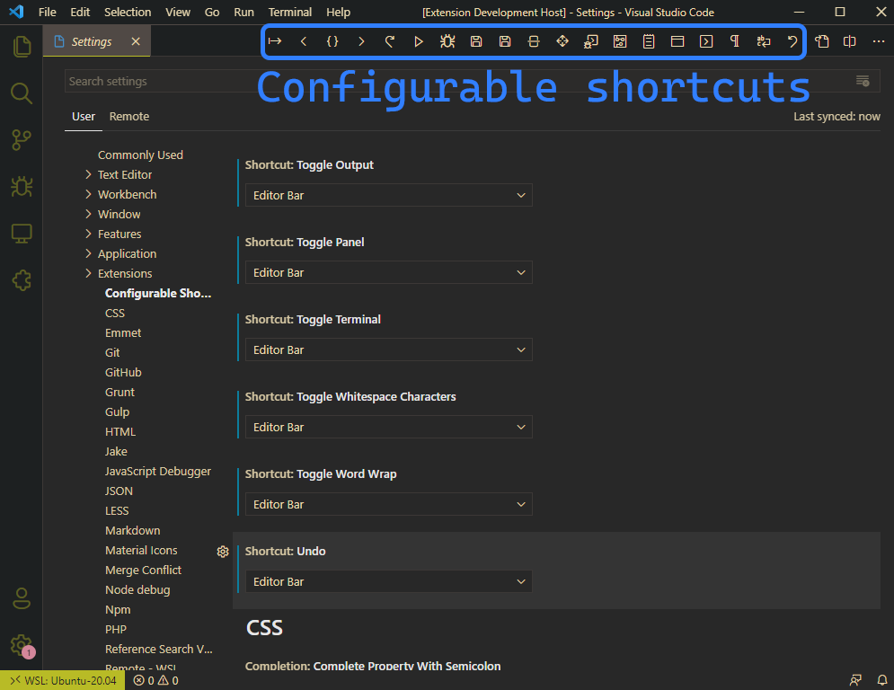
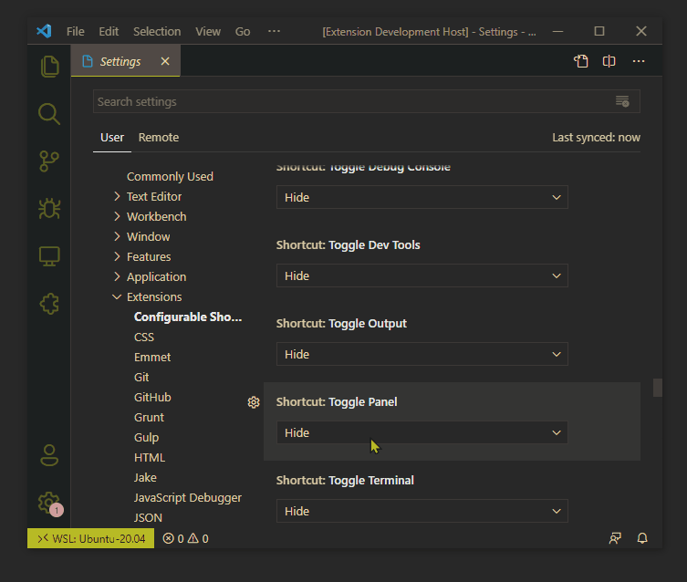

# VSCode Configurable Shortcuts

This is an extension that lets you configure some additional buttons in VSCode

## Features

Configure additional button in either the editor bar or the status bar (left or right).

List of currently supported buttons:

* Toggle Panel
* Toggle Output
* Toggle Debug Console
* Toggle Terminal
* Toggle Developer Tools
* Format File
* Toggle Word Wrap
* Toggle Whitespace Characters
* Save
* Save All
* Back
* Forward
* Undo
* Redo
* Split Editor Down
* Add Cursors To Line Ends
* Toggle Column Selection Mode
* Run
* Run With Debug

## Known Issues

For some reason the Output, Debug Console and Terminal toggles don't actually "toggle" when in the status bar, but do in the editor bar. The same exact command is being executed either way, so I haven't been able to debug further. I would write a custom function to detect when the panel is open and close it if so (to enable true "toggle" functionality), but the VSCode API currently has no way for me to detect that the panel is open. If this really bugs you, I found just having the Toggle Panel in the status bar to be a good replacement since that one (for some unknown reason) is a true "toggle".
